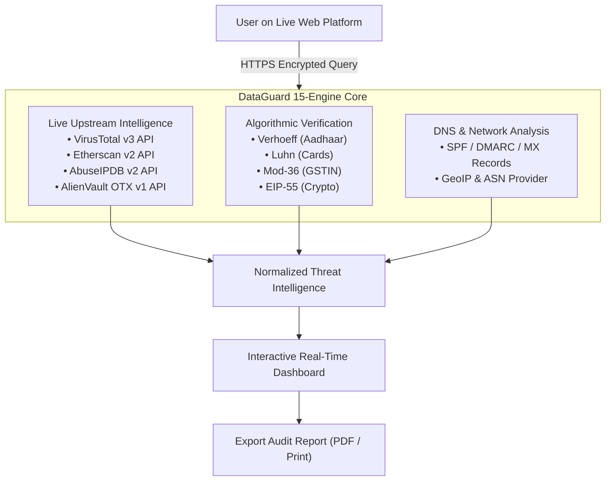

> [!NOTE]
> **DataGuard v2.0 is live:** 15 genuine verification engines, real-time VirusTotal (v3) multi-antivirus scanning, live Etherscan (v2) on-chain telemetry, AlienVault OTX threat pulses, AbuseIPDB v2 intelligence, and instant 1-click PDF Security Audit reports.

# 🛡️ DataGuard
### Autonomous Multi-Identifier Intelligence & Algorithmic OSINT Suite

  <strong>Verify identities, inspect on-chain telemetry, audit email authentication, and conduct real-time cyber threat reconnaissance.</strong>

  <strong>Developed by <a href="https://www.linkedin.com/in/jojin-john/">JOJIN JOHN</a></strong>

  
  
  
  
  
  
  
  

  🌐 <strong>Access the live web application:</strong> 
  <a href="https://dataguard-suite.vercel.app"><code>https://dataguard-suite.vercel.app</code></a>

100% genuine algorithmic validation • Client-safe zero-knowledge design • Proprietary web platform

---

> [!TIP]
> **Zero Knowledge Architecture:** Passwords are never sent across the wire (queried via HaveIBeenPwned k-Anonymity 5-char SHA-1 prefix model). Payment cards are validated purely mathematically using the ISO/IEC 7812 Luhn algorithm (zero CVV or expiry requested).

---

## 📑 Table of Contents
- [What is DataGuard?](#-what-is-dataguard)
  - [Why DataGuard Exists](#why-dataguard-exists)
  - [Mathematical Integrity vs Mock Data](#mathematical-integrity-vs-mock-data)
  - [Zero-Knowledge & Privacy Architecture](#zero-knowledge--privacy-architecture)
- [Architecture & Data Flow](#-architecture--data-flow)
- [The 15 Verification Engines](#-the-15-verification-engines)
  - [1. Identity & Public Accounts](#1-identity--public-accounts)
  - [2. Government & Transport (India)](#2-government--transport-india)
  - [3. Financial & Web3 Intelligence](#3-financial--web3-intelligence)
  - [4. Cyber & Threat Reconnaissance](#4-cyber--threat-reconnaissance)
- [Live Upstream Intelligence Integrations](#-live-upstream-intelligence-integrations)
- [Export & PDF Audit Reports](#-export--pdf-audit-reports)
- [Terms of Use & Proprietary Rights](#-terms-of-use--proprietary-rights)
- [Frequently Asked Questions (FAQ)](#-frequently-asked-questions-faq)
- [Author & Contact](#-author--contact)

---

## 🧭 What is DataGuard?

**DataGuard** is a full-stack, real-time cybersecurity and Open-Source Intelligence (OSINT) platform engineered to bridge the gap between individual identity exposure and live threat reconnaissance. 

Unlike traditional static lookup tools that rely on simulated data, DataGuard pairs **pure mathematical checksum algorithms** (Verhoeff Dihedral D5, Luhn Mod-10, Mod-36) with **live upstream threat telemetry** (VirusTotal 90-vendor AV scanner, Etherscan on-chain node query, AbuseIPDB, AlienVault OTX, and HaveIBeenPwned).

<strong>Why DataGuard Exists</strong>

Digital exposure today is fragmented. A developer or security analyst investigating an incident usually has to toggle between 6 different websites: a breach checker, a block explorer, an IP reputation database, a DNS analyzer, and an identity validator.

DataGuard unifies this entire workflow into a single, cohesive, client-safe SaaS application with 15 specialized engines and 1-click exportable PDF security reports.

<strong>Mathematical Integrity vs Mock Data</strong>

Every engine inside DataGuard implements genuine, official standards:
- **UIDAI Verhoeff Algorithm**: Implements the official Dihedral group $D_5$ permutation matrix to validate 12-digit Indian Aadhaar numbers.
- **GSTIN Mod-36 Checksum**: Uses the Goods and Services Tax Network (GSTN) alphanumeric weight matrix to verify business identifiers.
- **Luhn Algorithm**: Implements ISO/IEC 7812 Mod-10 verification to check credit and debit card structure without transmitting sensitive information.
- **EIP-55**: Computes Keccak-256 (SHA3-256) mixed-case checksums for Ethereum and EVM addresses.

<strong>Zero-Knowledge & Privacy Architecture</strong>

DataGuard is engineered with privacy as a hard requirement:
- **No data retention**: All requests are evaluated in-memory and discarded. No user database is attached.
- **k-Anonymity Model**: Passwords are never sent across the wire. Only the first 5 characters of the SHA-1 hash are queried against HaveIBeenPwned's index of billions of leaked credentials.
- **Non-intrusive payment verification**: Card checks require only the card number to calculate Luhn validity and identify the issuing bank (zero CVV, expiration date, or cardholder name).

---

## 🏗️ Architecture & Data Flow

---

## ⚡ The 15 Verification Engines

| # | Engine | Target Input | Genuine Algorithmic / Live Telemetry Feature |
| :-: | :--- | :--- | :--- |
| **1** | 📧 **Email Exposure** | `user@example.com` | Cross-references XposedOrNot live database + discovers linked Gravatar and GitHub avatars. |
| **2** | 📱 **Phone Intelligence** | `+91 9820012345` | Global ITU-T E.164 normalization, carrier identification, Indian (+91) telecom circle blocks, and direct WhatsApp links. |
| **3** | 🪪 **Aadhaar (UIDAI)** | `XXXX-XXXX-1234` | Official Dihedral $D_5$ (Verhoeff) mathematical algorithm + Masked Aadhaar privacy validation. |
| **4** | 💳 **PAN Card** | `ABCDE1234F` | 10-character Income Tax syntax validation + entity category decoding (Individual, Company, Firm, Trust). |
| **5** | 👤 **Username OSINT** | `username` | Concurrent multi-platform profile search across GitHub, Reddit, HackerNews, GitLab, and Chess.com. |
| **6** | 🏢 **GSTIN (Indian GST)** | `27AAPFU0939F1ZV` | 15-char structure validation, State/UT mapping, embedded PAN extraction, and official **Mod-36 Checksum**. |
| **7** | 🚗 **Vehicle RC & DL** | `MH12AB1234` / `DL...` | MoRTH standard Driving License format + Vehicle RC registration and Indian State RTO office mapping. |
| **8** | 🗳️ **Voter ID (EPIC)** | `ABC1234567` | Validates standard Election Commission of India (ECI) 10-character alphanumeric EPIC card syntax. |
| **9** | 💳 **Card BIN & Luhn** | `4000 0012 3456 7897` | Mathematical **Luhn Algorithm (Mod-10)** check + IIN/BIN bank identification (Zero CVV/expiry required). |
| **10** | 🪙 **Crypto Wallet** | `0x...` / `bc1...` | EIP-55 Ethereum checksum, Bitcoin SegWit/Taproot, Solana Base58 + **Live Etherscan on-chain node telemetry**. |
| **11** | 🔑 **Password Strength** | `password` | Privacy-preserving **k-Anonymity SHA-1** leak count check against billions of pwned passwords + NIST strength gauge. |
| **12** | 🌐 **IP & AbuseIPDB** | `118.25.6.39` / `8.8.8.8` | Geolocation + **AbuseIPDB v2** confidence score + **VirusTotal multi-AV** + **AlienVault OTX threat pulses**. |
| **13** | 🛡️ **Domain Spoofing** | `google.com` | Real-time Node.js DNS resolution for **SPF**, **DMARC** (`p=reject`), and **MX** records + **VirusTotal 90-vendor AV scanner breakdown**. |
| **14** | 🗑️ **Disposable Email** | `test@10minutemail.com`| Live registry check against 400+ temporary burner email services. |
| **15** | #️⃣ **Hash Identifier** | `5d41402abc...` | Cryptographic signature detection (MD5, SHA-1, SHA-256, bcrypt, Argon2) + rainbow plaintext lookup. |

---

## 🔑 Live Upstream Intelligence Integrations

DataGuard directly connects to official upstream security APIs:

* **Etherscan (v2 API)**: Queries Ethereum mainnet nodes via API v2 for real-time account Wei balance, live USD exchange rates, and transaction nonce.
* **VirusTotal (v3 API)**: Inspects domains and IP addresses across 90+ antivirus and security vendors (`last_analysis_stats`).
* **AlienVault OTX (v1 API)**: Open Threat Exchange indicator of compromise (IoC) pulse telemetry and APT adversary attribution.
* **AbuseIPDB (v2 API)**: 90-day threat report telemetry, abuse confidence percentage, Tor exit status, and attack logs.

---

## 🖨️ Export & PDF Audit Reports

DataGuard includes a built-in **Export Report (PDF)** feature. When auditing an IP, domain, cryptocurrency wallet, or identity:
1. Click the **Export Report (PDF)** button at the top-right of any result.
2. The custom `@media print` stylesheet automatically hides search bars, tabs, particles, and navigation chrome.
3. Your browser opens the print preview, formatting a clean, audit-ready security report on a white background suitable for compliance filings, clients, or documentation.

---

## 🔒 Terms of Use & Proprietary Rights

> [!IMPORTANT]
> **Proprietary Software — All Rights Reserved.**
> 
> * **Usage**: Users and security researchers are welcome to freely access and use the hosted web platform.
> * **Source Code Protection**: The architecture, algorithms, and design of DataGuard are the intellectual property of **JOJIN JOHN**.
> * **Restrictions**: Cloning, modifying, mirroring, distributing, or deploying copies of this source code or derivative works without explicit written consent from the author is strictly prohibited.

---

## ❓ Frequently Asked Questions (FAQ)

<strong>Are user searches logged or stored on a database?</strong>

No. DataGuard has zero database connections and retains no search logs. All evaluations happen purely in-memory and are streamed directly back to the requesting client.

<strong>Is it safe to test my payment card number?</strong>

Yes. DataGuard **never** asks for or accepts CVV codes, expiration dates, or cardholder names. It evaluates only the mathematical Luhn algorithm (Mod-10) and checks the first 6 digits against public Bank Identification Number (BIN) registries.

<strong>How can I use DataGuard?</strong>

You can access the live service directly through the deployed web portal.

---

## 📄 Author & Contact

Developed with pride by **[JOJIN JOHN](https://www.linkedin.com/in/jojin-john/)** ([@jojin1709](https://github.com/jojin1709)).

* **LinkedIn**: [linkedin.com/in/jojin-john](https://www.linkedin.com/in/jojin-john/)
* **GitHub**: [github.com/jojin1709](https://github.com/jojin1709)

*Copyright © 2026 JOJIN JOHN. All rights reserved.*
